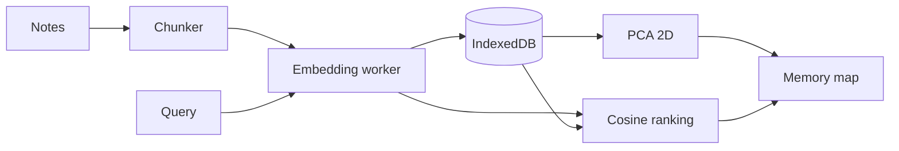

# recall-local

Search your own notes by meaning with local embeddings. Nothing leaves the browser.

- Search your notes by meaning with local embeddings
- A memory map of your notes with zoom, pan and note labels
- Notes stored on the device in IndexedDB
- Works on phones
- No server and no account

## Try it

[](https://vercel.com/new/clone?repository-url=https%3A%2F%2Fgithub.com%2Fedgeorgie%2Frecall-local)

```bash
npm install
npm run dev
```

Open http://localhost:3000. Requires Node 22 or newer.

1. Press Try with sample notes, or add .md and .txt files.
2. Ask in your own words. Matches glow on the map.
3. Scroll to zoom, drag to pan, double click to reset.

## Configuration

No environment variables. API keys are entered in the app and stay in the browser.

## How it works



Added files are chunked, embedded in a worker and stored. A query is embedded and ranked against stored vectors. The map projects all vectors to two dimensions. Full diagrams and the module map are in [docs/architecture.md](docs/architecture.md).

## Key concepts

| Term | Meaning |
|---|---|
| Passage | A chunk of a note of roughly 70 words. |
| Embedding | A vector for the meaning of text, computed locally. |
| Semantic search | Finding by meaning: 'what to wear in rain' matches 'pack a rain jacket'. |
| PCA | Projection of high-dimensional vectors to two dimensions for the map. |
| IndexedDB | Browser storage where notes and vectors persist on the device. |

## Design system

Typography: Display and text, Manrope, weight 800 for titles; Code and labels, JetBrains Mono.

| Token | Value | Use |
|---|---|---|
| `night` | `#08110e` | Page background |
| `panel` | `#0f1b17` | Surfaces |
| `text` | `#e8f4ee` | Primary text |
| `muted` | `#7f9a8e` | Secondary text |
| `mint` | `#5cf2b0` | Primary accent |
| `amber` | `#ffc857` | Note color |

- The map is the hero: the notes become a place.
- Six note colors keep documents distinguishable.

Motion, components and rationale: [docs/design-system.md](docs/design-system.md).

## Data flow and privacy

| Data | Where it goes | Stored |
|---|---|---|
| Notes and vectors | Computed and stored in the browser | IndexedDB |
| Embedding model | Downloaded once from the model host, then cached | Browser cache |
| Queries | Stay in the browser | Not stored |

## Limits

- Only .md and .txt files.
- A small model is less precise on very short passages.
- IndexedDB can be blocked in private browsing.

## Deployment

The app is fully client-side, so it can be hosted as static files.

- **GitHub Pages:** `npm run deploy:pages` builds a static export and publishes it to the `gh-pages` branch. Enable Pages from that branch; on a free plan the repository must be public.
- **Vercel or any Node host:** use the Deploy button above. No configuration is needed.

## Documentation

| Document | What it answers |
|---|---|
| [docs/index.md](docs/index.md) | Map of all documentation |
| [docs/architecture.md](docs/architecture.md) | Diagrams and modules |
| [docs/spec/spec.md](docs/spec/spec.md) | Requirements and acceptance criteria |
| [docs/spec/traceability.md](docs/spec/traceability.md) | Requirement to code, test and evidence |
| [docs/design-system.md](docs/design-system.md) | Tokens, motion, components |
| [docs/glossary.md](docs/glossary.md) | Definitions |
| [docs/evaluation.md](docs/evaluation.md) | Self-assessment against a review rubric |
| [docs/adr](docs/adr) | Decision records |

## For AI agents and tools

- [AGENTS.md](AGENTS.md) defines the workflow and quality gates for agents and people.
- [llms.txt](public/llms.txt) is served at `/llms.txt` when deployed and points to the key documents.
- [docs/spec/requirements.json](docs/spec/requirements.json) is the machine-readable requirement list with status, files and tests.
- `npm run verify` is the single deterministic gate: typecheck, lint, traceability check, tests and build.

LLM integration: No language model generates text here. The embedding model runs locally and its output is numbers only, so there is no prompt injection surface.

## Scripts

| Script | Purpose |
|---|---|
| `npm run dev` | Development server |
| `npm run build` | Production build |
| `npm run typecheck` | TypeScript check |
| `npm run lint` | ESLint |
| `npm test` | Unit tests |
| `npm run spec:check` | Traceability gate |
| `npm run verify` | All of the above |

## Contributing

See [CONTRIBUTING.md](CONTRIBUTING.md). Security reports: [SECURITY.md](SECURITY.md).

## License

MIT. Uses Transformers.js (Apache-2.0).
