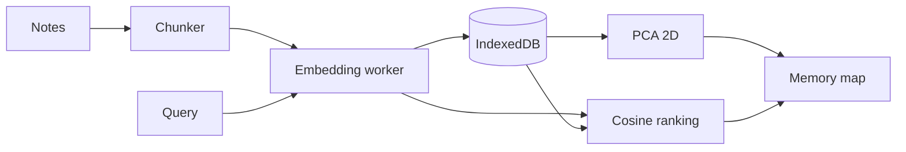
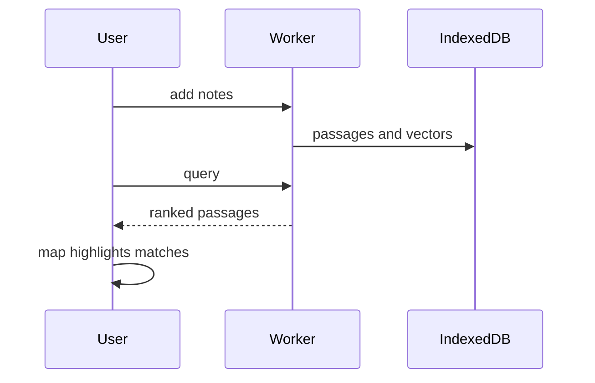

# Architecture

## Data flow

## Main sequence

## Modules

| Path | Responsibility |
|---|---|
| `lib/notes.ts` | Chunking and snippets |
| `lib/embedder.ts` | Worker client |
| `lib/store.ts` | IndexedDB access |
| `lib/pca.ts` | 2D projection |
| `lib/vector.ts` | Retrieval |
| `components/MemoryMap.tsx` | Canvas map |

## Principles

- Pure logic lives in `lib/` and is tested without a browser; components stay thin.
- Network, storage and model replies are validated at the boundary.
- Secrets and user content stay in the browser.

## Decisions

- [PCA for the map](adr/0001-pca-for-the-map.md)
